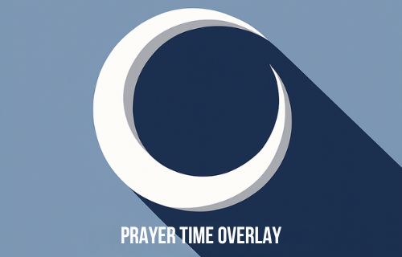

<div align="center">
  
</div>

# Prayer Time Overlay

> A modern desktop app that displays full-screen prayer time reminders across all screens, ensuring everyone is notified simultaneously without disruptions.

[](https://www.electronjs.org/)
[]()

---

## ✨ Features

- 🕌 **Full-Screen Overlay** - Displays prayer reminders on all screens simultaneously
- ⏰ **Custom Prayer Times** - Configure Fajr, Zuhr, Asr, Maghrib, and Isha times
- ᎗ **System Tray Integration** - Runs silently in the background
- 🚀 **Auto-Start on Boot** - Option to start automatically after reboot
- ⌨️ **Quick Dismiss** - Press ESC or click to close overlay
- 🎨 **Modern UI** - Clean, beautiful interface with smooth animations
- 🌍 **Cross-Platform** - Works on Windows, macOS, and Linux
- 🔔 **Helpful Notifications** - To remind us to get ready, perform Udhu

---

## 🚀 Quick Start

### Installation

```bash
# Clone the repository
git clone https://github.com/YOUR_USERNAME/prayer-time-overlay.git
cd prayer-time-overlay

# Install dependencies
npm install

# Run the app
npm start
```

### Usage

1. **Launch the app** - The app runs in your system tray
2. **Open Settings** - Right-click the tray icon → Settings
3. **Configure Times** - Set your prayer times in 24-hour format (HH:MM)
4. **Enable Auto-Start** (optional) - Toggle "Start automatically after reboot"
5. **Save Settings** - Your preferences are saved automatically

The overlay will appear automatically at the configured prayer times.

---

## 📦 Building

```bash
# Build for your platform
npm run build:win    # Windows
npm run build:mac    # macOS
npm run build:linux  # Linux

# Build for all platforms
npm run build
```

Built files will be in the `dist/` directory.

---

## ⚙️ Configuration

Prayer times and settings are stored locally:

- **Windows**: `%APPDATA%/prayer-time-overlay/prayer-times.json`
- **macOS**: `~/Library/Application Support/prayer-time-overlay/prayer-times.json`
- **Linux**: `~/.config/prayer-time-overlay/prayer-times.json`

---

## 🛠️ Tech Stack

- **Electron 28** - Cross-platform desktop framework
- **HTML/CSS/JavaScript** - Modern web technologies
- **electron-builder** - Application packaging

---

## 📝 License

Not configured yet.

---

## 🤝 Contributing

Pull requests are welcome! For major changes, please open an issue first to discuss what you would like to change.

